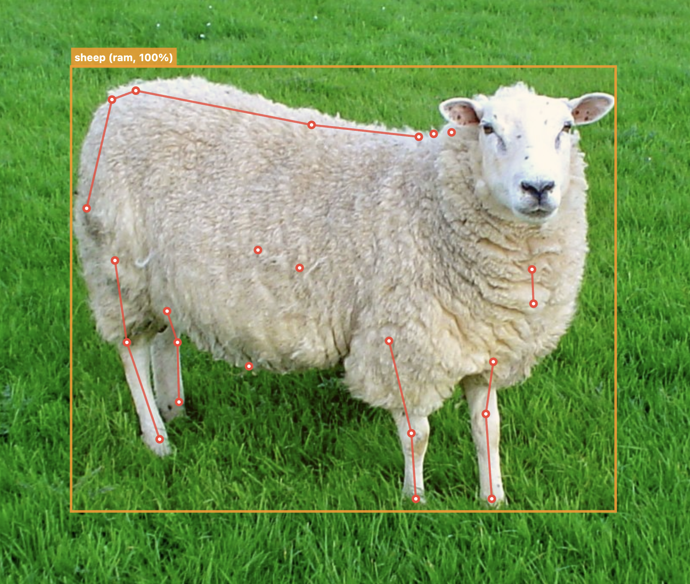

<h1 align="center">animal_detection</h1>

<p align="center">
<a href="https://flutter.dev"></a>
<a href="https://dart.dev"></a>
<br>
<a href="https://pub.dev/packages/animal_detection"></a>
<a href="https://pub.dev/packages/animal_detection/score"></a>
<a href="https://github.com/hugocornellier/animal_detection/blob/main/LICENSE"></a>
</p>

<p align="center">
  
  
</p>

On-device animal detection, species classification, and body pose estimation using TensorFlow Lite.
Detects animals, classifies species/breed, and extracts 24 SuperAnimal body keypoints using a multi-stage pipeline (SSD detection, MobileNetV3 classification, RTMPose/HRNet pose estimation).
Completely local: no remote API, just pure on-device, offline detection.

## Features

- Animal body detection with bounding box
- Species and breed classification (dog, cat, fox, bear, etc.)
- 24-point SuperAnimal body pose estimation (spine, neck, tail, limbs)
- Two pose model variants: RTMPose-S (fast, bundled) and HRNet-w32 (accurate, downloaded on demand)
- Truly cross-platform: compatible with Android, iOS, macOS, Windows, and Linux
- Configurable performance with XNNPACK, GPU, and CoreML acceleration

## Quick Start

```dart
import 'package:animal_detection/animal_detection.dart';

final detector = AnimalDetector();
await detector.initialize();

// imageBytes is a Uint8List of encoded image data (PNG, JPG, BMP, WebP, etc.)
final animals = await detector.detect(imageBytes);
for (final animal in animals) {
  print('${animal.species} (${animal.breed}) at ${animal.boundingBox} score=${animal.score}');
  if (animal.pose != null) {
    print('Keypoints: ${animal.pose!.landmarks.length}');
  }
}

await detector.dispose();
```

## Configuration Options

The `AnimalDetector` constructor accepts several configuration options:

```dart
final detector = AnimalDetector(
  poseModel: AnimalPoseModel.rtmpose,       // Pose model variant
  enablePose: true,                          // Enable body pose estimation
  cropMargin: 0.20,                          // Margin around detected body for pose crop
  detThreshold: 0.5,                         // SSD detection score threshold
  performanceConfig: PerformanceConfig.disabled, // Performance optimization (default: disabled)
);
```

| Option | Type | Default | Description |
|--------|------|---------|-------------|
| `poseModel` | `AnimalPoseModel` | `rtmpose` | Pose model variant |
| `enablePose` | `bool` | `true` | Whether to run pose estimation |
| `cropMargin` | `double` | `0.20` | Margin around detected body crop (0.0-1.0) |
| `detThreshold` | `double` | `0.5` | SSD detection score threshold (0.0-1.0) |
| `performanceConfig` | `PerformanceConfig` | `disabled` | Hardware acceleration config |

## Pose Model Variants

| Model | Size | Decoder | Accuracy |
|-------|------|---------|----------|
| **RTMPose-S** (default) | 11.6 MB | SimCC-based | Fast |
| **HRNet-w32** | 54.6 MB | Heatmap-based | Most accurate |

HRNet is downloaded on first use and cached locally. You can track download progress:

```dart
final detector = AnimalDetector(poseModel: AnimalPoseModel.hrnet);
await detector.initialize(
  onDownloadProgress: (model, received, total) {
    print('$model: ${(received / total * 100).toStringAsFixed(1)}%');
  },
);
```

## Detection Result

Each detected animal is returned as an `Animal` object:

| Field | Type | Description |
|-------|------|-------------|
| `boundingBox` | `BoundingBox` | Body bounding box in absolute pixel coordinates |
| `score` | `double` | SSD detector confidence (0.0-1.0) |
| `species` | `String?` | Predicted species (e.g. `"dog"`, `"cat"`) |
| `breed` | `String?` | Predicted breed (e.g. `"golden_retriever"`, `"tabby"`) |
| `speciesConfidence` | `double?` | Species classifier confidence (0.0-1.0) |
| `pose` | `AnimalPose?` | Body pose keypoints (null if pose estimation disabled) |
| `imageWidth` | `int` | Width of the source image in pixels |
| `imageHeight` | `int` | Height of the source image in pixels |

## Supported Species

The classifier recognizes the following species and breeds (mapped from ImageNet classes):

| Species | Breed Count | Examples |
|---------|-------------|----------|
| Dog | 151 | Chihuahua, Labrador, German Shepherd, Golden Retriever, Pug, Dalmatian |
| Cat | 5 | Tabby, Tiger Cat, Persian, Siamese, Egyptian |
| Fox | 4 | Red Fox, Kit Fox, Arctic Fox, Grey Fox |
| Bear | 4 | Brown Bear, American Black Bear, Polar Bear, Sloth Bear |
| Rabbit | 3 | Wood Rabbit, Hare, Angora |
| Cow | 3 | Ox, Water Buffalo, Bison |
| Sheep | 3 | Ram, Bighorn, Ibex |
| Deer | 3 | Hartebeest, Impala, Gazelle |
| Horse | 1 | Sorrel |
| Zebra | 1 | Zebra |

Animals detected but not matching a known species are labeled `"unknown_animal"`.

## Performance

### Hardware Acceleration

The package automatically selects the best acceleration strategy for each platform:

| Platform | Default Delegate | Speedup | Notes |
|----------|-----------------|---------|-------|
| **macOS** | XNNPACK | 2-5x | SIMD vectorization (NEON on ARM, AVX on x86) |
| **Linux** | XNNPACK | 2-5x | SIMD vectorization |
| **iOS** | Metal GPU | 2-4x | Hardware GPU acceleration |
| **Android** | XNNPACK | 2-5x | ARM NEON SIMD acceleration |
| **Windows** | XNNPACK | 2-5x | SIMD vectorization (AVX on x86) |

No configuration needed - just call `initialize()` and you get the optimal performance for your platform.

### Advanced Performance Configuration

```dart
// Auto mode (default) - optimal for each platform
await detector.initialize();

// Force XNNPACK (all native platforms)
final detector = AnimalDetector(
  performanceConfig: PerformanceConfig.xnnpack(numThreads: 4),
);
await detector.initialize();

// Force GPU delegate (iOS recommended, Android experimental)
final detector = AnimalDetector(
  performanceConfig: PerformanceConfig.gpu(),
);
await detector.initialize();

// CPU-only (maximum compatibility)
final detector = AnimalDetector(
  performanceConfig: PerformanceConfig.disabled,
);
await detector.initialize();
```

## Body Pose Keypoints (24-Point)

The `pose` property returns an `AnimalPose` object with up to 24 SuperAnimal body keypoints.

### Keypoint Groups

| Group | Count | Points |
|-------|-------|--------|
| Neck/Throat | 4 | Neck base, neck end, throat base, throat end |
| Spine | 3 | Back base (withers), back middle, back end |
| Tail | 2 | Tail base, tail tip |
| Front legs | 6 | Left/right thigh, knee, paw |
| Back legs | 6 | Left/right thigh, knee, paw |
| Body | 3 | Belly bottom, body middle left/right |

### Accessing Keypoints

```dart
final Animal animal = animals.first;

if (animal.pose != null) {
  // Iterate through all keypoints
  for (final kp in animal.pose!.landmarks) {
    print('${kp.type.name}: (${kp.x}, ${kp.y}) confidence=${kp.confidence}');
  }

  // Access a specific keypoint
  final tail = animal.pose!.getLandmark(AnimalPoseLandmarkType.tailEnd);
  if (tail != null) {
    print('Tail tip at (${tail.x}, ${tail.y})');
  }
}
```

### Drawing the Skeleton

Use the `animalPoseConnections` constant to draw skeleton lines between connected keypoints:

```dart
for (final connection in animalPoseConnections) {
  final from = animal.pose!.getLandmark(connection[0]);
  final to = animal.pose!.getLandmark(connection[1]);
  if (from != null && to != null) {
    canvas.drawLine(Offset(from.x, from.y), Offset(to.x, to.y), paint);
  }
}
```

## Bounding Boxes

The `boundingBox` property returns a `BoundingBox` object representing the animal body bounding box in absolute pixel coordinates.

```dart
final BoundingBox boundingBox = animal.boundingBox;

// Access edges
final double left = boundingBox.left;
final double top = boundingBox.top;
final double right = boundingBox.right;
final double bottom = boundingBox.bottom;

// Calculate dimensions
final double width = boundingBox.right - boundingBox.left;
final double height = boundingBox.bottom - boundingBox.top;

print('Box: ($left, $top) to ($right, $bottom)');
print('Size: $width x $height');
```

## Model Details

| Model | Size | Input | Purpose |
|-------|------|-------|---------|
| SSD body detector | ~4 MB | 320x320 | Animal body detection and bounding box |
| Species classifier | ~9 MB | 224x224 | Species and breed classification |
| RTMPose-S | 11.6 MB | 256x256 | 24-point body pose estimation (fast) |
| HRNet-w32 | 54.6 MB | 256x256 | 24-point body pose estimation (accurate) |

## OpenCV Mat Input

For advanced use cases (e.g. camera frames), you can pass an OpenCV `Mat` directly:

```dart
import 'package:animal_detection/animal_detection.dart';

final mat = imdecode(imageBytes, IMREAD_COLOR);
final animals = await detector.detectFromMat(
  mat,
  imageWidth: mat.cols,
  imageHeight: mat.rows,
);
```

## Background Isolates

To run detection in a background isolate, use `initializeFromBuffers` to avoid asset loading issues:

```dart
await detector.initializeFromBuffers(
  bodyDetectorBytes: bodyModelBytes,
  classifierBytes: classifierModelBytes,
  speciesMappingJson: speciesMappingJsonString,
  poseModelBytes: poseModelBytes,   // optional
);
```

## HRNet Cache Management

Check if the HRNet model is already cached or clear the model cache:

```dart
final cached = await AnimalDetector.isHrnetCached();
await ModelDownloader.clearCache();  // Deletes all cached models
```

## Error Handling

| Exception | When |
|-----------|------|
| `StateError` | `detect()` or `detectFromMat()` called before `initialize()` |
| `HttpException` | HRNet model download fails (non-200 status) |

If image decoding fails or no animals are detected, `detect()` returns an empty list.

## Credits

Body detection and pose models based on [SuperAnimal](https://github.com/DeepLabCut/DeepLabCut) pretrained models.

## Example

The [sample code](https://pub.dev/packages/animal_detection/example) from the pub.dev example tab includes a
Flutter app that paints detections onto an image: bounding boxes, species labels, and 24-point body pose keypoints.
